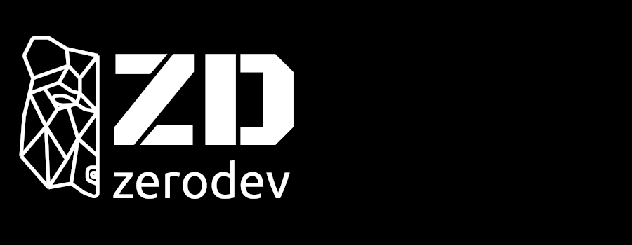

# zettlrobert

## I’m currently working on ...
Multiple Full-Stack Web Applications with slightly different stacks... 

I did hate the template but currently do not have the time to create fancy gifs and a tasty markdown, so tables it is.

## I’m currently learning ...

| language  | why i choose to learn it   | 
|-------------- | -------------- | 
| TypeScript    | The base for my daily work who does not like typed languages?     | 
| JavaScript | TypeScripts ancestor, everyone has to start somewhere |
| Lua | I use neovim, and I love using my own configuration scripts, that could be useful if i decide to switch to awesomewm as well |
| Go | Efficient, simplistic language which allows me to create cross platform binaries and can be used with WebAssembly | 
| sh/bash | Good old scripts to automate and make live easy |

## Things I like
| Thing   | Reason   | 
|-------------- | -------------- | 
| FOSS | Free And Open Source Software <3 |
| Linux    | Freedom, customization, personalization, if done right reliability     | 
| Docker | Resource saving virtualization, which makes dev and prod easier on any system |
| Hardware | I like to play with my own servers, have a 'lab' and get to know new Technologies |

There is so much more i like and would have to add to the list, unfortunately there would be no end...

### Stuff I am currently learning 
- ansible
- kuberneetes
- terraform
- rust
- every language I already use, one can always improve

📫 How to reach me: ...
You can always reach me via email `zettl.robert@gmail.com` or via my personal website(That one urgently needs a rework and a AWS-SES integration). 

<!--
**zettlrobert/zettlrobert** is a ✨ _special_ ✨ repository because its `README.md` (this file) appears on your GitHub profile.

Here are some ideas to get you started:

- 👯 I’m looking to collaborate on ...
- 🤔 I’m looking for help with ...
- 💬 Ask me about ...
- 😄 Pronouns: ...
-->
